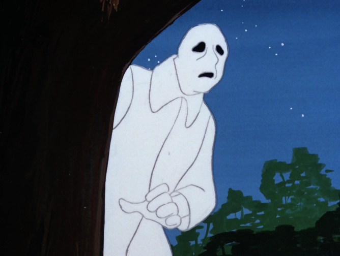

# Spirit

💡 EMF 5 | 🔊 Spirit Box | 🖊️ Writing

## Unique Traits

* Spirits have no special abilities or unique behaviors compared to other ghosts.

## Hunt Behavior

* When a Smudge Stick is used near a Spirit, it will not be able to initiate a hunt for 180 seconds instead of the usual 90 seconds for most other ghosts. This does not prevent cursed hunts.

<figure><figcaption>
Pictured: The Spirit creeping outside his ex-girlfriend's house after seeing her go live on Snap. 
</figcaption></figure>

## Identification Strategies

* The main way to test for a Spirit without using evidence is to lower the average sanity to below 50% and smudge the ghost while it is not hunting. If the ghost does not initiate a hunt before three minutes have passed, it is likely a Spirit.
* If the Spirit hunts before three minutes have passed, the Smudge Stick did not work, and the player should attempt to smudge it again.
* In Nightmare difficulty, players should wait for a hunt or a burnt crucifix to confirm that the average sanity is low enough.

## False Positives

* Spirits have no unique defining traits that can easily differentiate them from other ghosts. Without clear evidence, a Spirit can be easily mistaken for another type of ghost.
* Although the journal describes Spirits as the most common ghost, all ghost types have an equal chance of being selected by the game.
